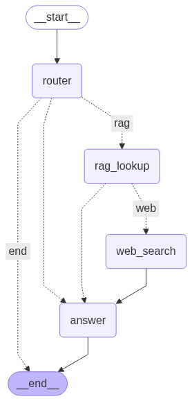
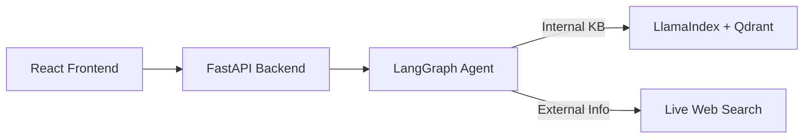

# **EduLLM: Your Personal AI/ML Tutor** 🚀

EduLLM is a **full-stack AI-powered tutor** for AI and Machine Learning concepts.  
It combines a conversational agent, advanced retrieval (RAPTOR), and live web search to deliver accurate, context-aware answers in real time.  

---

## Documentation

The complete project documentation is available here:  
[📄 View Documentation (Google Docs)](https://docs.google.com/document/d/1gaK0aDQVCIfNv4vnBjpYr-bybA24Zi8j9UbJdovWiWo/edit?usp=sharing)

## **✨ Features**  

- **User Accounts & Saved Chats** – Secure JWT-based authentication with persistent conversation history.  
- **Agentic Conversational AI** – Decides when to use **internal RAG** vs **live web search** for the best answer.  
- **Advanced RAG (RAPTOR)** – Context-aware retrieval from curated AI/ML documents.  
- **Live Web Search** – Accesses the latest information for up-to-date responses.  
- **Responsive UI** – Clean, modern, mobile-friendly React interface.  

---

## **🛠 Tech Stack**  

| Layer | Technology | Purpose |
| --- | --- | --- |
| **Frontend** | React, React Router, Axios | Dynamic SPA & API communication |
| **Backend** | Python, FastAPI | Async API & business logic |
| **AI Orchestration** | LangChain, LangGraph | Conversational agent & tool control |
| **RAG** | LlamaIndex (RAPTOR), Qdrant | Retrieval, vector storage, similarity search |
| **Auth** | JWT (python-jose) | Secure login |
| **Database** | SQLite | User data & chat history |

---

## **📐 Architecture Overview**


  



1. **React SPA** – User interacts with the web app.  
2. **FastAPI Backend** – Handles auth, chat history, and queries.  
3. **LangGraph Agent** – Decides whether to use RAG or web search.  
4. **RAG Pipeline** – Qdrant vector store + RAPTOR retrieval.  
5. **Response Generation** – Agent composes the final answer.  

---

## **📚 Pre-Loaded RAG Documents**  

| Resource | Topics | License | Link |
| --- | --- | --- | --- |
| UC Berkeley CS 188 Textbook | AI foundations, search, RL, Bayes nets, ML basics | CC BY-SA 4.0 | [PDF Link](http://ai.berkeley.edu/cs188_textbook/cs188-textbook.pdf) |
| Dive into Deep Learning | Deep learning theory & code | CC BY-SA 4.0 (text), MIT (code) | [PDF Link](https://d2l.ai/d2l-en.pdf) |
| Machine Learning Cheat Sheet | Quick ML reference | CC BY-SA 3.0 | [PDF Link](https://github.com/soulmachine/machine-learning-cheat-sheet/raw/master/machine-learning-cheat-sheet.pdf) |

---

## ⚡ Setup & Installation  

### **Prerequisites**  
- Python 3.10+  
- Node.js & npm  
- Git  
- Qdrant (download from [GitHub releases](https://github.com/qdrant/qdrant/releases))  

---

### **1️⃣ Clone the Repository**  
```bash
git clone https://github.com/VihaanMotwani/EduLLM.git
cd EduLLM
```

---

### **2️⃣ Start Qdrant Server**  
In a **new terminal**:  

**macOS / Linux**  
```bash
./qdrant
```

**Windows (PowerShell)**  
```powershell
.\qdrant.exe
```

Verify Qdrant is running by visiting: [http://localhost:6334/dashboard](http://localhost:6334/dashboard)  

---

### **3️⃣ Backend Setup**  
In a **new terminal**:  
```bash
cd backend
python -m venv venv
```

**Activate Virtual Environment:**  

**macOS / Linux**  
```bash
source venv/bin/activate
```

**Windows (PowerShell)**  
```powershell
venv\Scripts\Activate.ps1
```

**Install Dependencies:**  
```bash
pip install -r requirements.txt
```

**Configure Environment Variables:**  
```bash
# macOS / Linux
cp .env.example .env

# Windows (PowerShell)
copy .env.example .env
```  
Edit `.env` to add your API keys (`OPENAI_API_KEY`, `TAVILY_API_KEY`, etc.).  

---

### **4️⃣ Index Documents for RAG**  
To enable retrieval from local knowledge base:  
```bash
# Place your PDFs/docs in:
backend/docs

# Run ingestion
python raptor_service.py
```

You only need to run this when documents are added/changed.  

---

### **5️⃣ Start Backend Server**  
```bash
uvicorn main:app --reload
```

---

### **6️⃣ Frontend Setup**  
In a **new terminal**:  
```bash
cd frontend
npm install
npm start
```

Now open the app at: [http://localhost:3000](http://localhost:3000) 🎯  

---

## **📄 License**  
MIT License – See `LICENSE` for details.  
